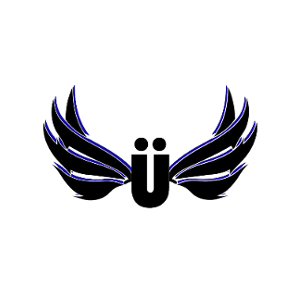
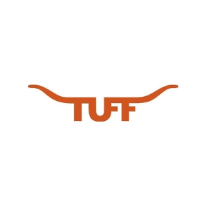
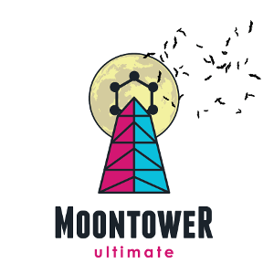
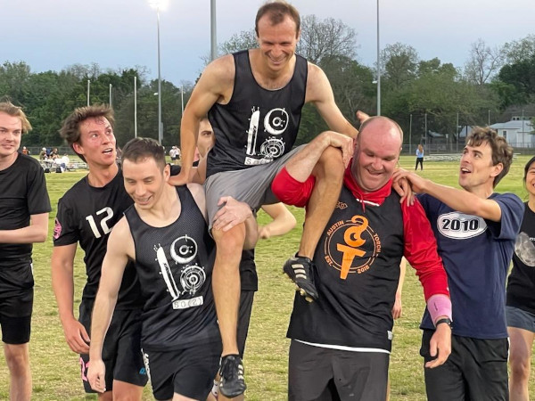

# Other stuff I do

--------------------------------------------------------------------

I spend a lot of time playing ultimate frisbee. Most recently I played with Mischief, a men's club team based in Canton, MI (not to be confused with the Bay Area mixed team of the same name). In past years I have played with the Saxy Divers (Leipzig, Germany) Pixel (Detroit, MI), Moontower (Austin, TX), TUFF (the University of Texas men's team) and Süperfly (the Yale University men's team, not to be confused with the similarly-named Stanford Univeristy women's team).

In grad school I also co-organized the University of Texas math department's IM ultimate team, SO(2). We [won the intramural championship](https://medium.com/inside-recsports-fall-winter-2022/the-ultimate-team-player-2ee37af2ae41) on April 14, 2022 (incidentally, the same day that I defended my PhD thesis.)

Back in 2017 I wrote some [articles](frisbee) for the team on basic frisbee strategy.

--------------------------------------------------------------------

Sometimes I also work on small programming projects. You can see a few of them on [my GitHub](https://github.com/tjweisman/).

 - [Geometry Tools](geometrytools)

 - [Dixit](dixit/) (note - this is currently defunct.)

 - [How to play *Let it Ride* optimally](frisbee/let_it_ride)

 - [Is it a horse, or is it a frisbee team?](frisbee/horseorfris/)

-------------------------------------------------------------------------

In grad school, my friends and I sometimes read short stories together! [Neža Žager Korenjak](https://web.ma.utexas.edu/users/nezz.zk/index.html) was our main organizer and keeps a [list](https://web.ma.utexas.edu/users/nezz.zk/story.html) of the stories we read in our club. [Casandra Monroe](https://sites.google.com/utexas.edu/cmonroe/) also keeps a [list](https://sites.google.com/utexas.edu/cmonroe/short-story-club) (also featuring song pairings for each story).
