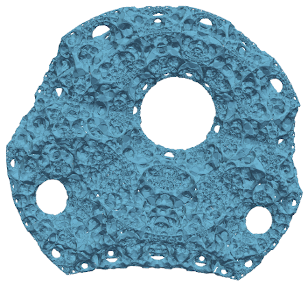
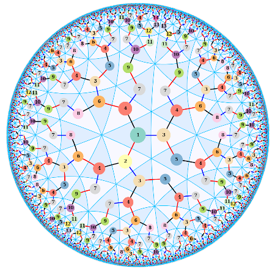
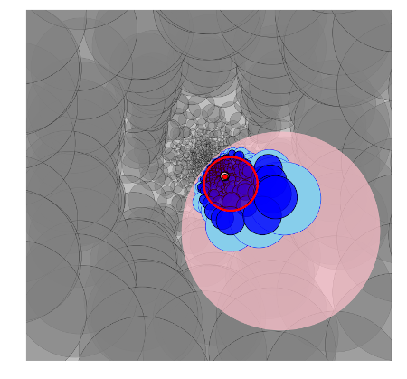
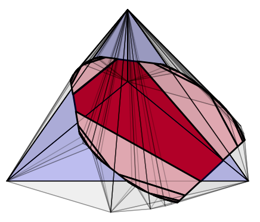

  

About me
===========

I'm Teddy, an NSF Postdoctoral Fellow in mathematics at the University of Michigan. Currently my research interests are in geometric structures on manifolds, discrete subgroups of Lie groups, and geometric group theory. My postdoctoral mentor at Michigan is [Ralf Spatzier](https://dept.math.lsa.umich.edu/~spatzier/).

I completed my PhD in 2022 at the University of Texas at Austin, where my advisor was [Jeff Danciger](https://web.ma.utexas.edu/users/jdanciger/index.html).

I will moving to the University of Virginia for a postdoctoral position in Fall 2026.

*************************************

## Contact

Pronouns: he/him

Email: [tjwei@umich.edu](mailto:tjwei@umich.edu)

*************************************

If you are interested in drawing nice pictures of the hyperbolic plane and projective space, check out my [geometry_tools](geometrytools) Python package!

*************************************

	

