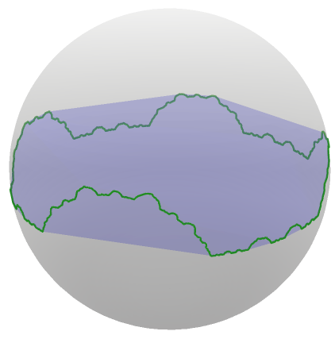
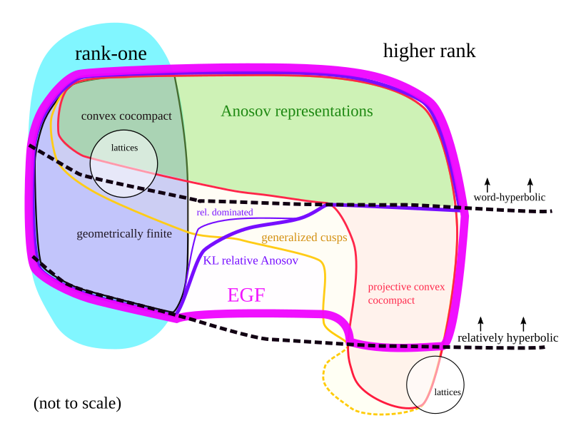
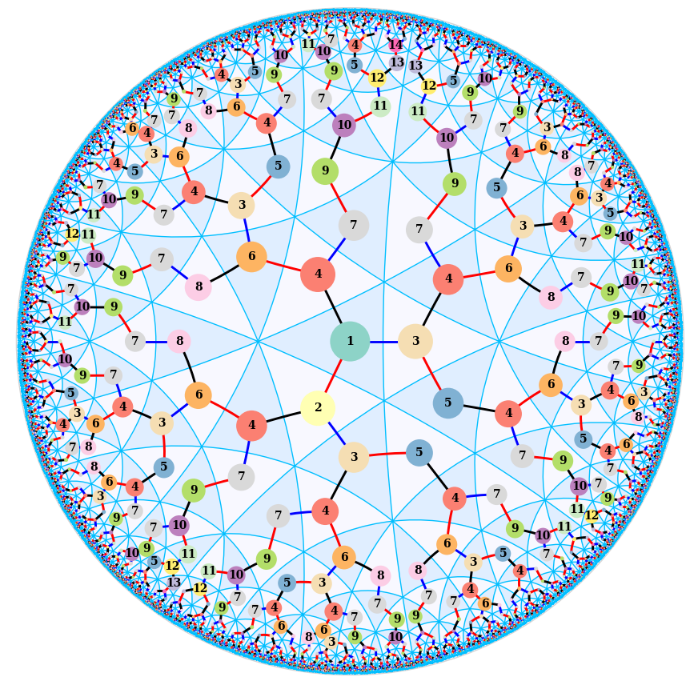
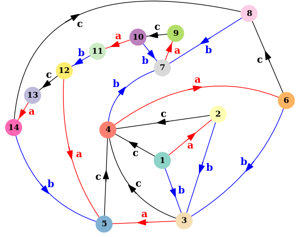
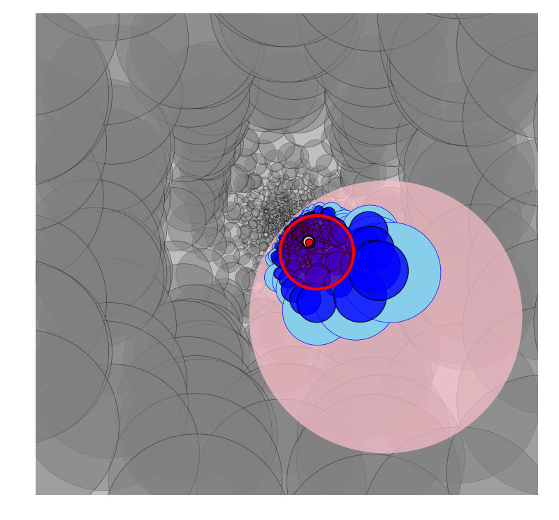
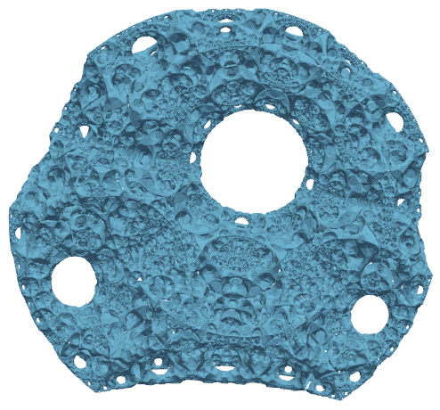
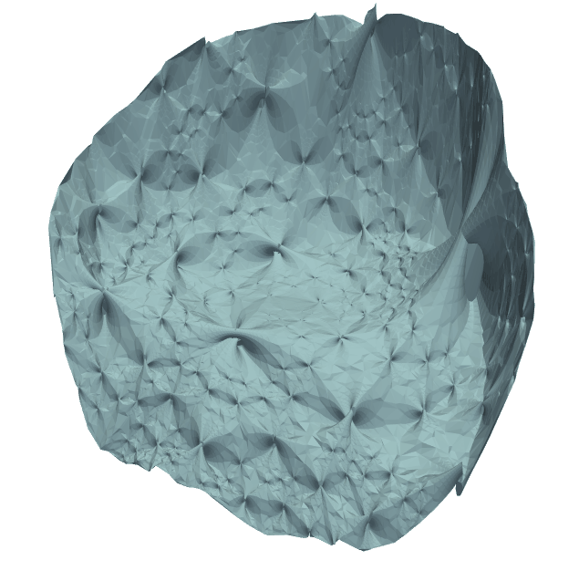
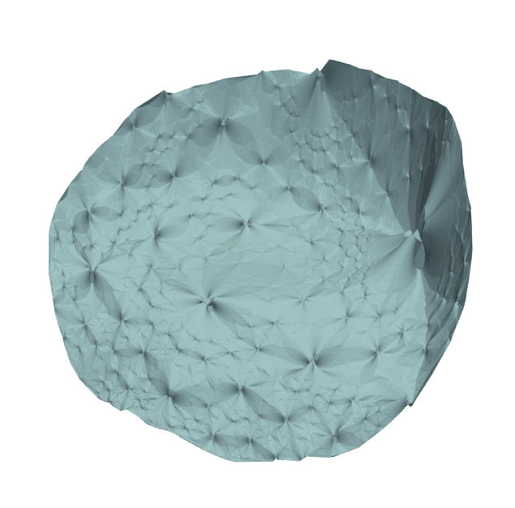
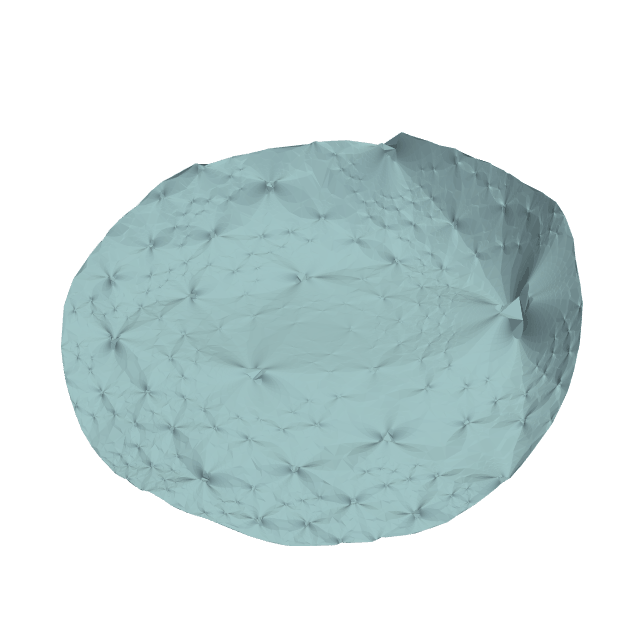

Research
==========

The main theme of my research is the interaction between geometric structures on manifolds, geometric group theory, and discrete subgroups of Lie groups. Mostly, this means that I work with actions of groups with rich coarse geometry (such as hyperbolic and relatively hyperbolic groups) on homogeneous spaces (like symmetric spaces, or projective space and other flag manifolds). Important examples include convex cocompact and geometrically finite subgroups of SL(2, R) and SL(2, C), as well as higher-rank analogs, such as Anosov subgroups and their generalizations.

The limit set of a convex cocompact representation in hyperbolic space (specifically, a quasifuchsian representation produced by bending). See an <a href="resources/bending2.gif">animated version</a>.

## Published and accepted articles

1. *An extended definition of Anosov representation for relatively hyperbolic groups*. To appear in *Journal of Topology*.

	[download](papers/extended_relative_anosov.pdf) \| [arXiv](https://arxiv.org/abs/2205.07183)

2. (with A. Guilloux) *Limits of limit sets in rank-one symmetric spaces*, 2024. To appear in *Geometriae Dedicata*.

	[download](papers/rank1_limit.pdf) \| [arXiv](https://arxiv.org/abs/2407.04301)

2. (with K. Tsouvalas) *Singular value gap estimates for free products of semigroups*, 2024. To appear in *Groups, Geometry, and Dynamics*.

	[download](papers/free_product_sv.pdf) \| [arXiv](https://arxiv.org/abs/2409.20330)

4. (with S. Douba, B. Fléchelles, and F. Zhu) *Cubulated hyperbolic groups admit Anosov representations.* Geom. Topol. 29 (2025) 4695–4766.

	[journal](https://msp.org/gt/2025/29-9/p04.xhtml) \| [download](papers/anosov_cubulated.pdf) \| [arXiv](https://arxiv.org/abs/2309.03695)

3. (with K. Mann and J.F. Manning) *Topological stability of relatively hyperbolic groups acting on their boundaries*. Math. Z. 312, 5, 2026.

	[journal](https://link.springer.com/article/10.1007/s00209-025-03882-9) \| [download](papers/stable_with_parabolic.pdf) \| [arXiv](https://arxiv.org/abs/2402.06144)

4. (with M. Islam) *Morse properties in convex projective geometry*. Adv. Math., 479:110430, 2025.

	[journal](https://www.sciencedirect.com/science/article/pii/S0001870825003287) \| [download](papers/morse_properties.pdf) \| [arXiv](https://arxiv.org/abs/2405.03269)

5. (with A. Traaseth) *Combination theorems for geometrically finite convergence groups.*  To appear in *Algebraic and Geometric Topology*.

	[download](papers/combination_convergence.pdf) \| [arXiv](https://arxiv.org/abs/2305.08011)

6. (with K. Mann and J.F. Manning) *Stability of hyperbolic groups acting on their boundaries,* 2022. To appear in *Groups, Geometry, and Dynamics*.

	[journal](https://ems.press/journals/ggd/articles/14298661) \| [download](https://pi.math.cornell.edu/~jfmanning/research/stable93.pdf) \| [arXiv](https://arxiv.org/abs/2206.14914)

7. *Dynamical properties of convex cocompact actions in projective space*. J. Topol., 16(3):990-1047, 2023. 

	[journal](https://doi.org/10.1112/topo.12307) \| [download](papers/convex_cocompact_dynamics.pdf) \| [arXiv](https://arxiv.org/abs/2009.10994)

## Preprints

1. *Dehn filling in semisimple Lie groups*. arXiv: 2502.17592, 2025. Submitted.

	[download](papers/dehn_filling_egf.pdf) \| [arXiv](https://arxiv.org/abs/2502.17592)

5. *Examples of extended geometrically finite representations.* arXiv:2311.18653, 2023.

	[download](papers/egf_examples.pdf) \| [arXiv](https://arxiv.org/abs/2311.18653)

[**PhD thesis:**](papers/thesis.pdf) *Higher-rank generalizations of convex cocompact and geometrically finite dynamics*.

Part of the landscape of discrete subgroups of Lie groups with "intermediate" behavior between rank-one and higher rank. EGF representations are introduced in my <a href="https://arxiv.org/abs/2205.07183">paper</a> "An extended definition of Anosov representation for relatively hyperbolic groups." 

## Talk slides and videos

Anosov representations of cubulated hyperbolic groups 
[slides](resources/talks/anosov_cubulated2025.pdf) \| [video](https://www.carmin.tv/en/collections/2025-t2-ws2-low-dimensional-phenomena-geometry-and-dynamics/video/anosov-representations-of-cubulated-hyperbolic-groups)

Dehn filling in semisimple Lie groups  
[slides](resources/talks/riverside2024.pdf) \| [video](https://www.slmath.org/video-details/29363/39344)

Combination theorems for geometrically finite convergence groups ([NCNGT](https://www.ncngt.org/topic-groups/lie-groups), June 2023) 
[video (part 1)](https://youtu.be/vvAQ6tRbTK0) \| [video (part 2)](https://youtu.be/lHSLgRjo3es)

Topological stability for (relatively) hyperbolic boundary actions (GTiNY, June 2023) 
[slides](resources/talks/gtiny2023.pdf)

Extended geometrically finite representations (STDC, March 2022)  
[slides](resources/talks/stdc2022_handout.pdf)

Extended convergence dynamics and relative Anosov representations (December 2021)  
[slides](resources/talks/rel_anosov_heidelberg.pdf)	

Expansion/contraction dynamics for non-strictly convex projective manifolds (GTA Philadelphia, June 2021)  
[slides](resources/talks/temple_2021_flat.pdf)

Group actions on boundaries of convex divisible domains (November 2019)  
[slides](resources/talks/gainesville_2019.pdf)

## Gallery

### Coxeter automaton

A shortlex <a href="https://en.wikipedia.org/wiki/Automatic_group">automatic structure</a> for a (3,3,4) triangle group in the hyperbolic plane, drawn using my <a href="geometry_tools">geometry_tools</a> Python package. Each numbered vertex is a state in a finite state automaton, generated using the <a href="https://gap-packages.github.io/kbmag/">kbmag program</a>.

This image was originally created for the <a href="https://www.ncngt.org/postcards">postcard session</a> of the 2021 <a href="https://www.ncngt.org/">Nearly Carbon Neutral Geometric Topology</a> conference.

### Figure-eight knot group automaton

Local structure of a finite-state "relative automaton" recognizing quasi-geodesics in the figure-eight knot group. This is an practical implementation of the construction used in <a href="https://arxiv.org/abs/2205.07183">arXiv:2205.07183</a> to prove relative stability properties of extended geometrically finite representations.

### Pontryagin spheres

An approximation of the limit set of a convex cocompact reflection group in O(4,1), studied by <a href="https://www.ihes.fr/~/douba/">Sami Douba</a>, Gye-Seon Lee, Ludovic Marquis, and <a href="https://sites.google.com/view/lorenzo-ruffoni">Lorenzo Ruffoni</a>. The limit set of this group is a Pontryagin sphere, embedded equivariantly into the ideal boundary of 4-dimensional hyperbolic space (a 3-sphere). 
<a href="resources/pontryagin_anim.gif">Animated version</a> (41MB file) | <a href="pontryagin_interactive.html">Interactive version</a> (5MB file, less detail)

Limit sets of deformations of a Bianchi group in PU(3,1), projected to a 3-dimensional slice in the boundary of complex hyperbolic 3-space. The original group has 2-sphere limit set; it has arbitrarily small deformations which are not isomorphic to it, and have Pontryagin sphere limit set converging to this 2-sphere. See an <a href="resources/deform_bianchi.gif">animation</a>.

