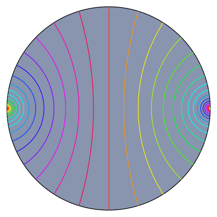
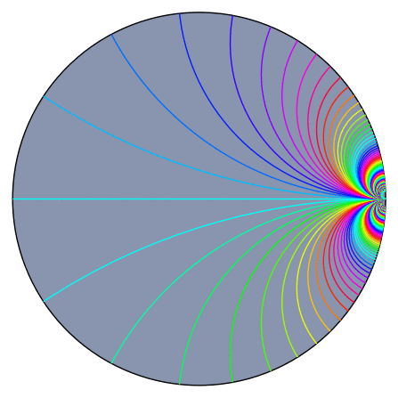
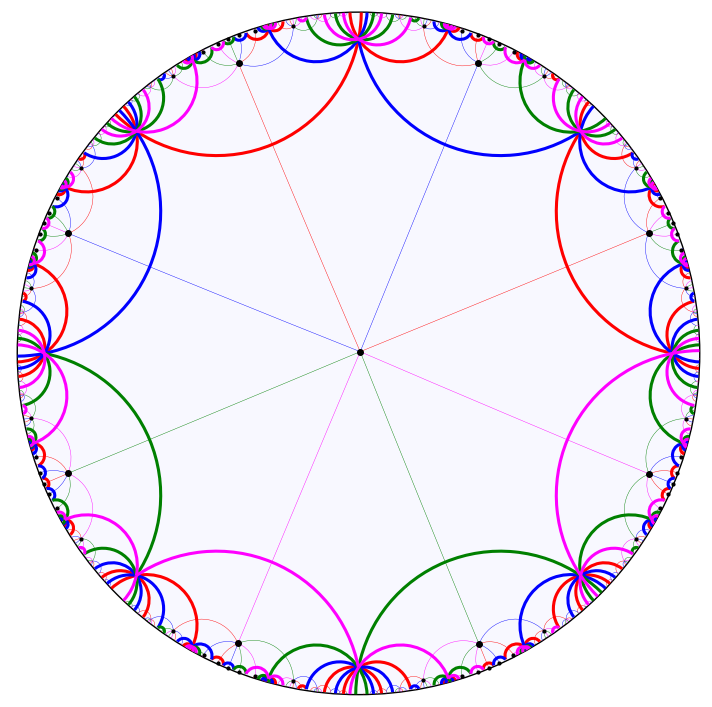
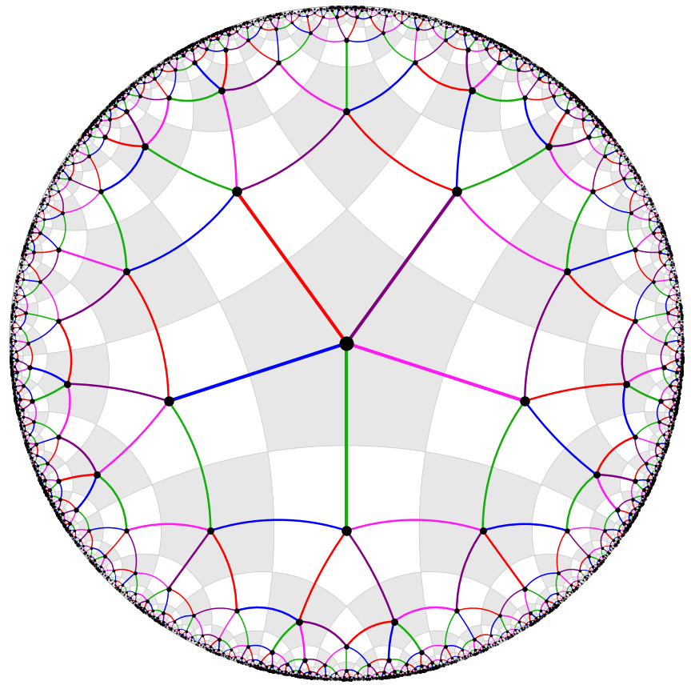

# Hyperbolic isometries

##### Hyperbolic isometry in the hyperbolic plane

##### Parabolic isometry in the hyperbolic plane

--------------------------

# Cayley graphs in the hyperbolic plane

##### Genus 2 surface group

##### Right-angled pentagon group

